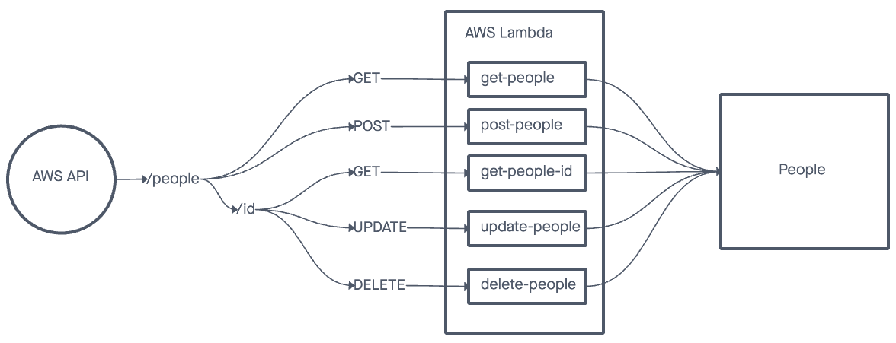
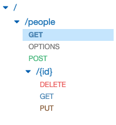

# serverless-api

## Feature Tasks

Create a single resource REST API using a domain model of your choosing, constructed using AWS Cloud Services

* Database: DynamoDB
  * 1 Table required

* Routing: API Gateway
  * POST
    * /people - Given a JSON body, inserts a record into the database
    * returns an object representing one record, by its id (##)
  * GET
    * /people - returns an array of objects representing the records in the database
    * /people/## - returns an object representing one record, by its id (##)
  * PUT
    * /people/## - Given a JSON body and an ID (##), updates a record in the database
    * returns an object representing one record, by its id (##)
  * DELETE
    * /people/## - Given an id (##) removes the matching record from the database
    * returns an empty object

* CRUD Operation Handlers: Lambda Functions

## UML

## Solution

I implemented each route as instructed. I implemented the routes with parameters by creating a sub-resource, and appropriate methods to go along with it.

